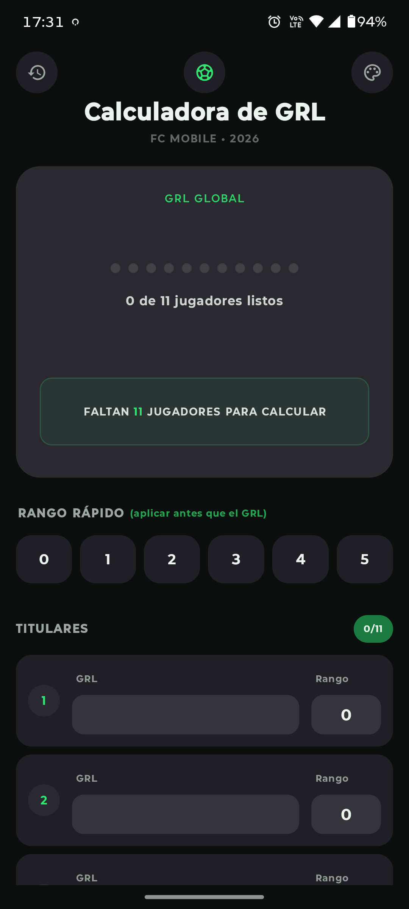
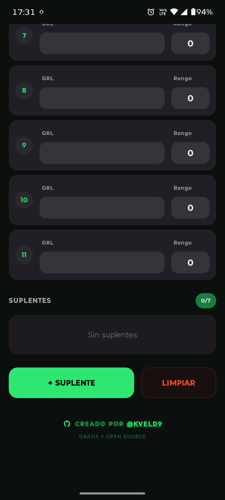
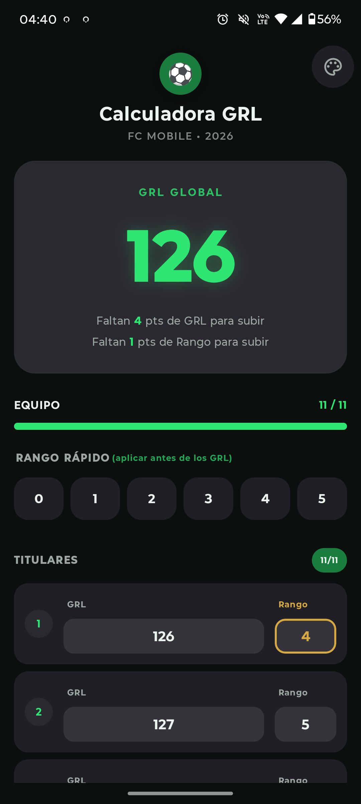
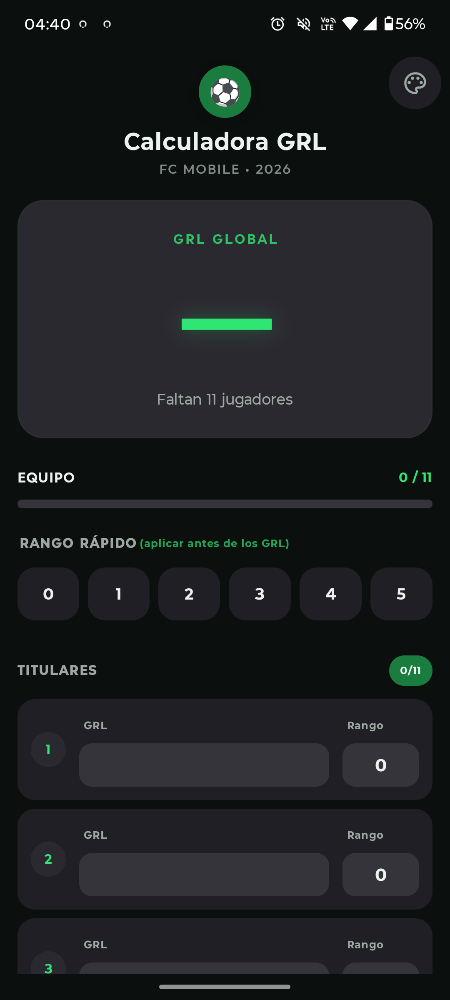
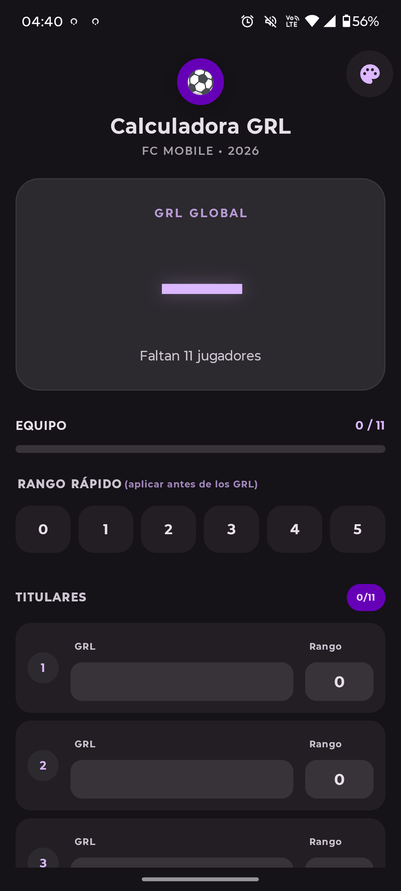
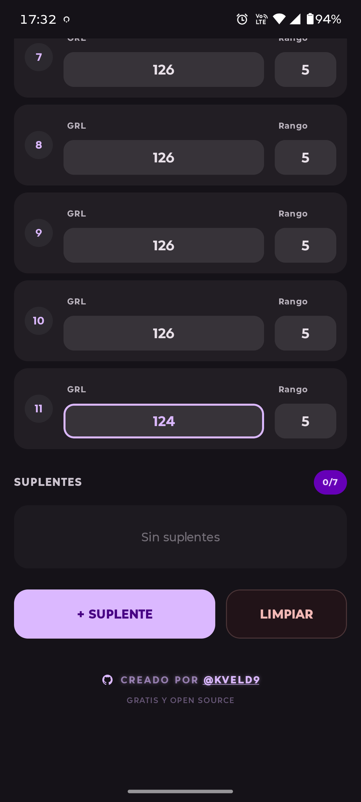

# FCM Calculator v1.2.0 — Calculadora GRL para FC Mobile

Calculadora ligera y moderna para Android, diseñada específicamente para calcular el **GRL (Global Rating Level)** en **FC Mobile**.
La aplicación está desarrollada íntegramente en **Kotlin** utilizando **Jetpack Compose** para una interfaz nativa, fluida y reactiva.

---

## Características

- **Cálculo automático del GRL global** a partir de los 11 titulares (y hasta 7 suplentes).
- **Gestión de titulares y suplentes**: añade o elimina suplentes fácilmente.
- **Rango rápido**: establece el rango de todos los jugadores con un solo toque (0‑5).
- **Indicador de progreso**: muestra cuántos titulares has completado en la barra de equipo.
- **Información de progreso**: te indica cuántos puntos de GRL base y de rango faltan exactamente para subir al siguiente nivel.
- **Material You**: soporte para **Color Dinámico** (en Android 12+) que adapta la interfaz a tu fondo de pantalla.
- **Diseño moderno**: interfaz limpia basada en **Material 3**.
- **Funciona offline**: no requiere conexión a Internet para realizar los cálculos.
- **Icono personalizado** adaptativo en el lanzador.
- **Soporte multi-idioma**: Disponible en Español e Inglés.

---

## Capturas de pantalla

<p align="center">
  
  
  
  
  
  
  
</p>

---

## Stack tecnológico

| Tecnología              | Versión / Uso                                               |
| ----------------------- | ----------------------------------------------------------- |
| **Kotlin**              | Lenguaje de programación principal                          |
| **Jetpack Compose**     | Toolkit moderno para la interfaz de usuario (Material 3)    |
| **Kotlin Coroutines**   | Gestión de tareas asíncronas y **StateFlow**                |
| **ViewModel**           | Gestión del estado de la UI persistente a cambios de config.|
| **DataStore**           | Almacenamiento persistente de preferencias (Color Dinámico) |
| **Gradle (Kotlin DSL)** | Sistema de gestión de dependencias y compilación            |
| **JUnit / Espresso**    | Pruebas unitarias e instrumentadas                          |
| **Testing libraries**   | JUnit 4 y `kotlinx-coroutines-test`                         |

---

## Estructura del proyecto

```text
FCMCalculator/
├── app/
│   └── src/
│       └── main/
│           ├── java/com/kveld9/fcmcalculator/
│           │   ├── data/
│           │   │   └── ThemePreferences.kt     # Gestión de preferencias (DataStore)
│           │   ├── domain/
│           │   │   └── GrlCalculator.kt        # Lógica de negocio (Cálculo GRL)
│           │   ├── ui/
│           │   │   ├── components/             # Piezas reutilizables de la UI
│           │   │   ├── model/                  # Modelos de vista y estados
│           │   │   ├── theme/                  # Configuración de Material 3
│           │   │   ├── viewmodel/              # Lógica de presentación (MVVM)
│           │   │   └── GrlScreen.kt            # Pantalla principal en Compose
│           │   └── MainActivity.kt             # Punto de entrada de la aplicación
│           ├── res/
│           │   ├── drawable/                   # Iconos y vectores
│           │   ├── mipmap-*/                   # Iconos adaptativos del launcher
│           │   └── values/                     # Strings y estilos base
│           └── AndroidManifest.xml
├── gradle/
├── build.gradle.kts
├── gradle.properties
├── gradlew
└── settings.gradle.kts
```

---

## Arquitectura

El proyecto sigue el patrón **MVVM (Model-View-ViewModel)** con **UDF (Unidirectional Data Flow)**, asegurando una separación clara de responsabilidades entre la lógica de negocio y la interfaz de usuario.

---

## Testing

La robustez de la aplicación está garantizada mediante:
- **Pruebas unitarias**: Cobertura de la lógica de negocio en `GrlCalculator.kt` y del estado en los ViewModels.
- **Tecnologías**: Uso de **JUnit 4** y **kotlinx-coroutines-test** para pruebas de flujos asíncronos.

---

## Requisitos

- **Android Studio** (versión Ladybug o superior recomendada)
- **JDK 11** o **17**
- **Android SDK**: `minSdk` 24 (Nougat), `targetSdk` 37.

---

## Cómo compilar

### Desde Android Studio

1. Clona el repositorio:
   ```bash
   git clone https://github.com/kveld9/FCMCalculator.git
   cd FCMCalculator
   ```
2. Abre el proyecto en Android Studio.
3. Espera a que Gradle sincronice las dependencias.
4. Ejecuta la app en un emulador o dispositivo físico.

### Desde línea de comandos

**Windows:**

```bash
gradlew.bat assembleDebug
```

**Linux / macOS:**

```bash
./gradlew assembleDebug
```

El APK se generará en: `app/build/outputs/apk/debug/`

---

## Cómo funciona la calculadora

La lógica de cálculo se encuentra en el archivo `domain/GrlCalculator.kt`. El cálculo se actualiza automáticamente gracias al estado reactivo de Compose.

- **GRL Global**:
  Se calcula mediante el promedio redondeado al alza de los GRL base (GRL - Rango) de todos los jugadores, sumado al promedio redondeado al alza de los rangos de todos los jugadores.

- **Fórmulas**:
  - `Promedio GRL Base = ceil(SUMA(GRL - Rango) / N)`
  - `Promedio Rangos = ceil(SUMA(Rango) / N)`
  - `GRL FINAL = Promedio GRL Base + Promedio Rangos`

- **Progreso**:
  La aplicación indica cuántos puntos faltan en total para que cualquiera de los dos promedios suba un punto.

---

## Desarrollo y personalización

- **Interfaz**: modifica los componentes en `app/src/main/java/com/kveld9/fcmcalculator/ui/GrlScreen.kt`.
- **Lógica**: ajusta las fórmulas en `app/src/main/java/com/kveld9/fcmcalculator/domain/GrlCalculator.kt`.
- **Estética**: cambia colores o formas en `app/src/main/java/com/kveld9/fcmcalculator/ui/theme/`.

---

## Licencia

Este proyecto está bajo la licencia **MIT**. Consulta el archivo [`LICENSE`](LICENSE) para más detalles.

---

## Autor

**Kveld** — [GitHub](https://github.com/kveld9)
