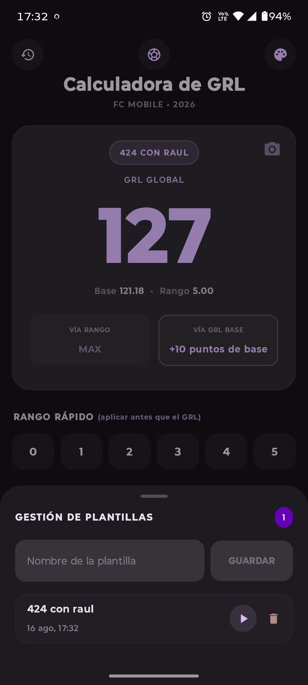
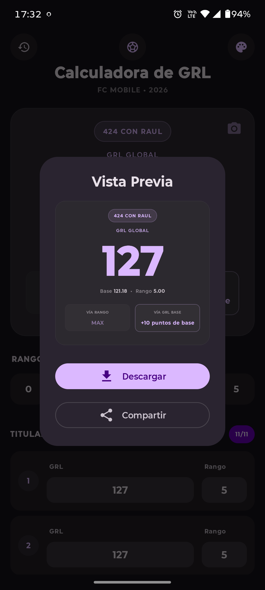
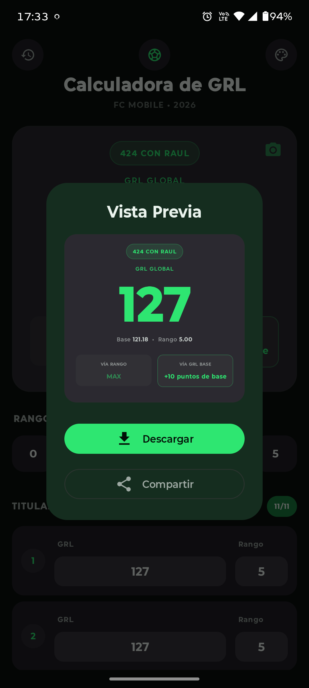

# Calculadora GRL para FC Mobile: FCMetrix

[](https://opensource.org/licenses/MIT)
[](https://kotlinlang.org)
[](https://developer.android.com)
[](https://en.wikipedia.org/wiki/Free_and_open-source_software)

Calculadora ligera y moderna para Android, diseñada específicamente para calcular y optimizar el **GRL (Global Rating Level)** en **FC Mobile**.
La aplicación está desarrollada íntegramente en **Kotlin** utilizando **Jetpack Compose (Material 3)** para ofrecer una interfaz nativa, fluida y reactiva.

---

## Características

- **Cálculo automático del GRL global**: a partir de los 11 titulares (y hasta 7 suplentes).
- **Gestión de titulares y suplentes**: añade o elimina suplentes dinámicamente con límites reglamentarios.
- **Rango rápido**: aplica el rango deseado a todos los jugadores con un solo toque (0‑5).
- **Gestión de Plantillas (Squad Management)**:
  - Guarda múltiples alineaciones personalizadas con nombre propio.
  - Carga y alterna entre diferentes plantillas guardadas al instante.
  - Elimina alineaciones con confirmación de seguridad.
  - Persistencia local mediante **Room Database**.
- **Sugerencias inteligentes y caminos de optimización**:
  - Muestra en paralelo las dos vías posibles para subir de nivel: **Vía GRL Base** vs. **Vía Rango**.
  - Identifica y destaca visualmente el **Camino más rápido** para alcanzar el próximo OVR.
- **Información de precisión**: promedios decimales exactos de **GRL Base** y **Rango** (ej. `125.81 • 4.90`) para comprender el algoritmo de redondeo de EA Sports.
- **Exportación y Compartir Tarjeta de Resultados**:
  - Vista previa modal de la tarjeta de resumen.
  - Guardado en alta calidad en la galería del dispositivo (`Pictures/FCMetrix`).
  - Compartir imagen directamente en apps de mensajería y redes sociales mediante `FileProvider`.
- **Material You y Color Dinámico**: soporte para paletas dinámicas basadas en el fondo de pantalla (Android 12+), con toggle manual persistente en DataStore.
- **Ícono Adaptativo & Themed Icons (Monocromo)**:
  - Soporte completo para íconos adaptativos y tema monocromático dinámico en Android 13+ (API 33).
- **Accesibilidad (TalkBack)**: descripciones semánticas enriquecidas para lectores de pantalla en todas las acciones, tarjetas y listas.
- **Rendimiento optimizado**: integración de **Baseline Profiles** para tiempos de inicio inmediatos y scroll sin jank.
- **Funciona 100% Offline**: todos los cálculos y datos se procesan en el dispositivo sin necesidad de conexión a Internet.
- **Soporte multi-idioma**: Español e Inglés con detección automática.
- **Privacidad y Ética**:
  - **Sin permisos sensibles**: No solicita acceso a cámara, ubicación ni contactos.
  - **Sin telemetría ni rastreo**: Cero analíticas, cero rastreadores. Tu actividad es privada.
  - **Código abierto (FOSS)**: Totalmente transparente y auditable por la comunidad.

---

## Capturas de pantalla

<p align="center">
  
  
  
  
  
</p>
<p align="center">
  
  
  
  
  
</p>

---

## Lógica de cálculo

El GRL Global se calcula utilizando por separado el promedio del GRL Base y el promedio del Rango.

### Fórmula

$$\text{GRL Global} = \lceil\text{Promedio GRL Base}\rceil + \lceil\text{Promedio Rango}\rceil$$

Donde:
- **Promedio GRL Base** $= \frac{\sum (\text{GRL}_i - \text{Rango}_i)}{N}$
- **Promedio Rango** $= \frac{\sum \text{Rango}_i}{N}$

El redondeo hacia arriba ($\lceil x \rceil$ / `ceil`) se aplica de forma independiente a cada promedio antes de realizar la suma final.

### Reglas de negocio

- **$N$ = total de jugadores con GRL asignado**.
- **Mínimo de jugadores**: 11 (si faltan titulares, no se calcula el GRL Global).
- **Máximo de jugadores**: 18 (11 titulares + hasta 7 suplentes).
- **Límites de GRL**: 47 – 150.
- **Límites de Rango**: 0 – 5.
- Los jugadores sin GRL cargado no participan del cálculo.
- **Prioridad de recomendación**: En caso de empate en la cantidad de puntos necesarios para subir de nivel entre GRL Base y Rango, se prioriza y recomienda la mejora de **GRL Base**.

---

## Stack tecnológico

| Tecnología                     | Versión / Uso                                                    |
| ------------------------------ | ---------------------------------------------------------------- |
| **Kotlin**                     | Lenguaje principal del proyecto                                  |
| **Jetpack Compose**            | UI declarativa moderna basada en **Material 3**                  |
| **Room Database**              | Persistencia SQLite local para alineaciones guardadas            |
| **DataStore Preferences**      | Almacenamiento reactivo de configuraciones (Color Dinámico)      |
| **Kotlinx Serialization**      | Serialización JSON segura para entidades y listas                |
| **Kotlin Coroutines & Flow**   | Programación asíncrona reactiva con `StateFlow`                  |
| **AndroidX Lifecycle**         | Arquitectura `ViewModel` con retención de estado                 |
| **KSP**                        | Kotlin Symbol Processing para Room y generadores de código       |
| **Baseline Profiles**          | Precompilación de rutas críticas para inicio y render ultra-rápido |
| **JUnit 4 & Espresso**         | Pruebas unitarias e instrumentadas automatizadas                 |
| **Gradle (Kotlin DSL)**        | Sistema de compilación y gestión de dependencias                 |

---

## Requisitos y Compilación

- **Android Studio**: Ladybug / Meerkat o superior.
- **Android SDK**: `minSdk 24` (Android 7.0+), `targetSdk 35` (Android 15), `compileSdk 37`.
- **JDK**: Java 17 / 21.
- **Compilar Debug APK**:
  ```bash
  ./gradlew assembleDebug
  ```
- **Ejecutar Tests Unitarios**:
  ```bash
  ./gradlew testDebugUnitTest
  ```

---

## Licencia

Este proyecto está bajo la licencia **MIT**. Consulta el archivo [`LICENSE`](LICENSE) para más detalles.

---

## Autor

**Kveld** — [GitHub](https://github.com/kveld9)
